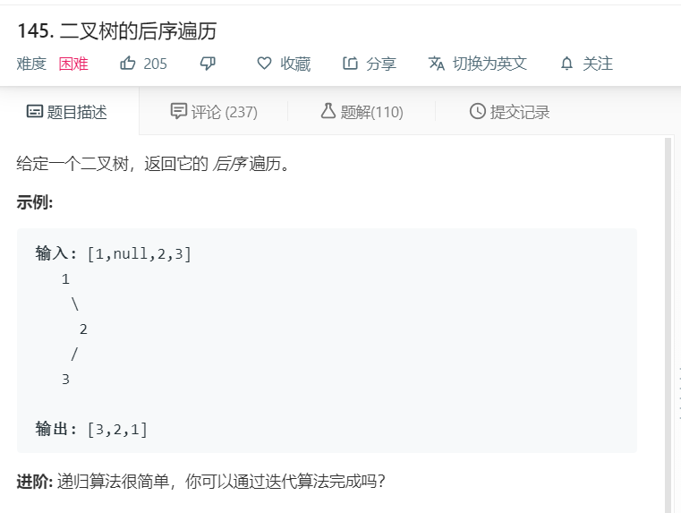

# 145.二叉树的后序遍历
  

```
/**
 * Definition for a binary tree node.
 * function TreeNode(val) {
 *     this.val = val;
 *     this.left = this.right = null;
 * }
 */
/**
 * @param {TreeNode} root
 * @return {number[]}
 */
var postorderTraversal = function(root) {
    let temp = [];
    function mid(r){
        if(!r){
            return;
        }

        mid(r.left);
        mid(r.right);
        temp.push(r.val);
    }

    mid(root);
    return temp;
};
```