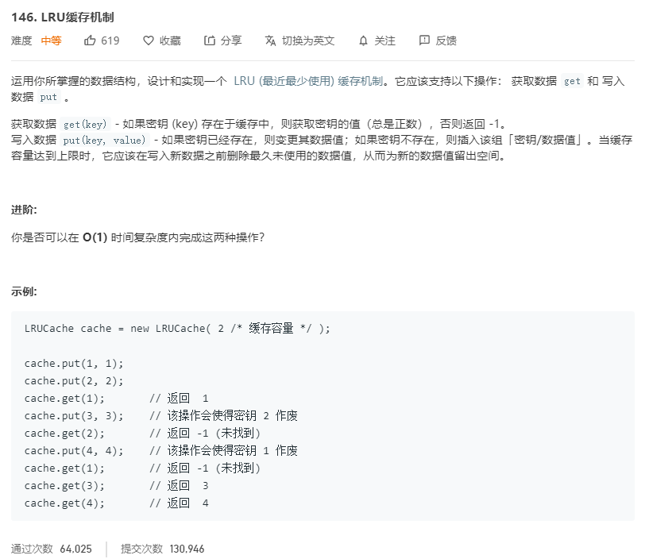

# 146.LRU缓存机制
  

```
/**
 * @param {number} capacity
 */
var LRUCache = function(capacity) {
    this.key = [];
    this.value = [];
    this.capacity = capacity;
};

/** 
 * @param {number} key
 * @return {number}
 */
LRUCache.prototype.get = function(key) {
    let posi = this.key.lastIndexOf(key);
    if(posi > -1){
        let tempkey = this.key.splice(posi,1);
        let tempvalue = this.value.splice(posi,1);
        this.key.push(tempkey[0]);
        this.value.push(tempvalue[0]);
        return tempvalue;
    }else {
        return -1;
    }
};

/** 
 * @param {number} key 
 * @param {number} value
 * @return {void}
 */
LRUCache.prototype.put = function(key, value) {
    let posi = this.key.lastIndexOf(key);
    if(posi > -1){
        this.key.splice(posi,1);
        this.value.splice(posi,1);
    }
    this.key.push(key);
    this.value.push(value);
    if(this.key.length > this.capacity) {
        this.key.shift();
        this.value.shift();
    }
};

/** 
 * Your LRUCache object will be instantiated and called as such:
 * var obj = new LRUCache(capacity)
 * var param_1 = obj.get(key)
 * obj.put(key,value)
 */
```