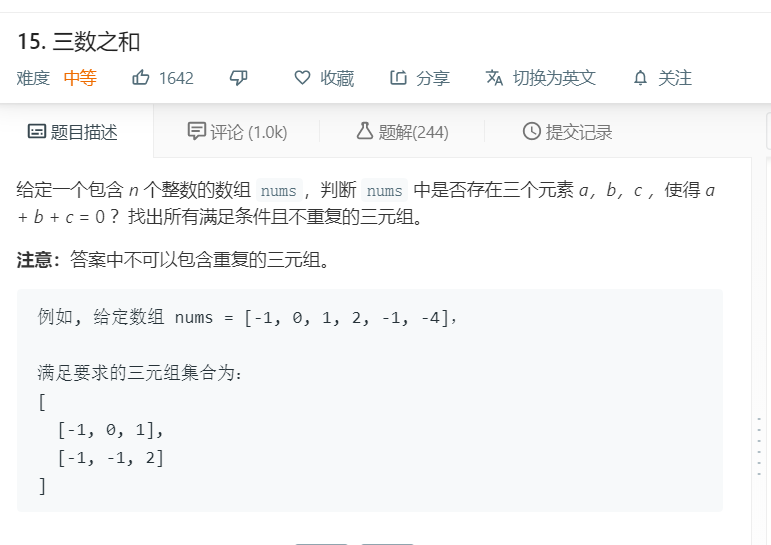

# 15.三数之和
  

```
/**
 * @param {number[]} nums
 * @return {number[][]}
 */
var threeSum = function(nums) {
    if(!nums || nums.length < 3){
        return [];
    }

    nums.sort((a,b)=>a-b);

    if(nums[0]>0){
            return [];
        }

    let result = [];
    for(let i=0;i<nums.length;i++){

        if(i>0 && nums[i] == nums[i-1]){
            continue;
        }

        let one = i+1,two = nums.length-1;

        while(one < two){
            if(nums[i] + nums[one] + nums[two] == 0){
                result.push([nums[i],nums[one],nums[two]]);
                while(one < two && nums[one] == nums[one+1]){
                    one++;
                }

                while(one < two && nums[two] == nums[two-1]){
                    two--;
                }

                 one++;
                two--;
            }else if(nums[i] + nums[one] + nums[two] > 0){
                two--;
            }else{
                one++;
            }
           
        }
    }

    return result;
};
```