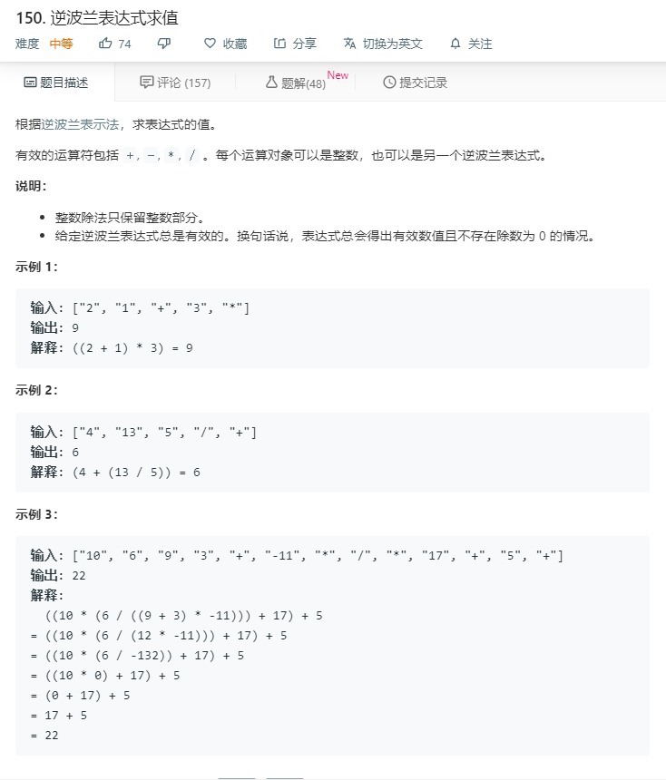

# 150.逆波兰表达式求值
  

```
/**
 * @param {string[]} tokens
 * @return {number}
 */
var evalRPN = function(tokens) {
    let temp = [];
    let mate = [
      '+',
      '-',
      '*',
      '/'
    ];
    for(let i=0;i<tokens.length;i++){
      if(mate.indexOf(tokens[i])<0){
        temp.push(parseInt(tokens[i]));
      }else{
        let cocal = [];
        cocal.push(temp.pop());
        if(tokens[i] == "+"){
          temp.push(temp.pop() + cocal.pop());
        }else if(tokens[i] == "-"){
          temp.push(temp.pop() - cocal.pop());
        }else if(tokens[i] == "*"){
          temp.push(temp.pop() * cocal.pop());
        }else{
          temp.push(parseInt(temp.pop() / cocal.pop()));
        }
      }
    }

    // console.log(temp[0]);
    return Math.ceil(temp[0]);
};
```