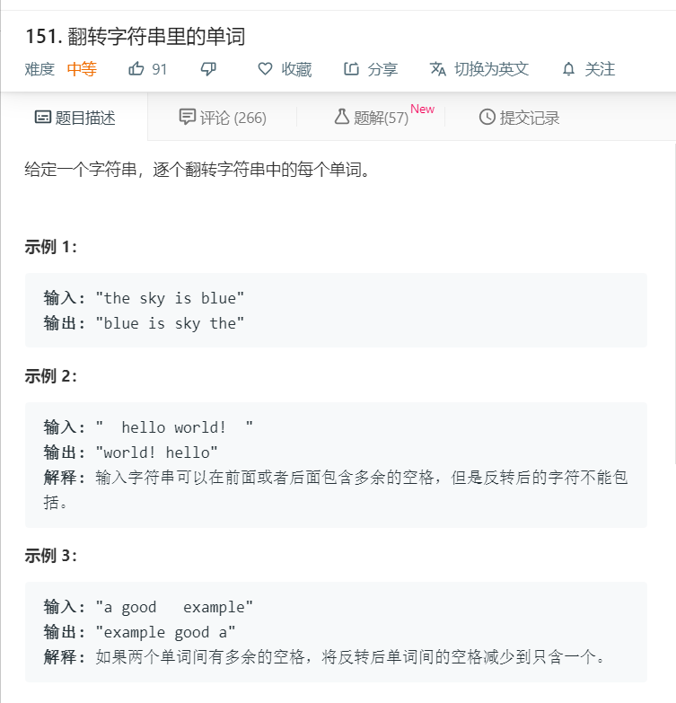

# 151.翻转字符串里的单词
  

```
/**
 * @param {string} s
 * @return {string}
 */
var reverseWords = function(s) {
    let temp = s.split(' '),result=[];
    for(let i=0;i<temp.length;i++){
      if(temp[i].length != '')
      {
        result.push(temp[i]);
      }
    }
    result.reverse();
    console.log(result.join(' '));
    return result.join(' ');
};
```