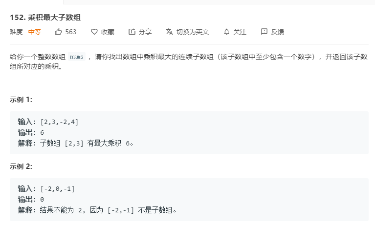

# 152.乘积最大子数组
  

```
/**
 * @param {number[]} nums
 * @return {number}
 */
var maxProduct = function(nums) {
    let max = -Infinity, maxi = 1, mini = 1;

    for(let i=0;i<nums.length;i++) {
        if(nums[i] < 0) {
            [maxi,mini] = [mini,maxi];
        }

        maxi = Math.max(maxi*nums[i],nums[i]);
        mini = Math.min(mini*nums[i],nums[i]);

        max = Math.max(maxi,max);
    }

    return max;
};
```