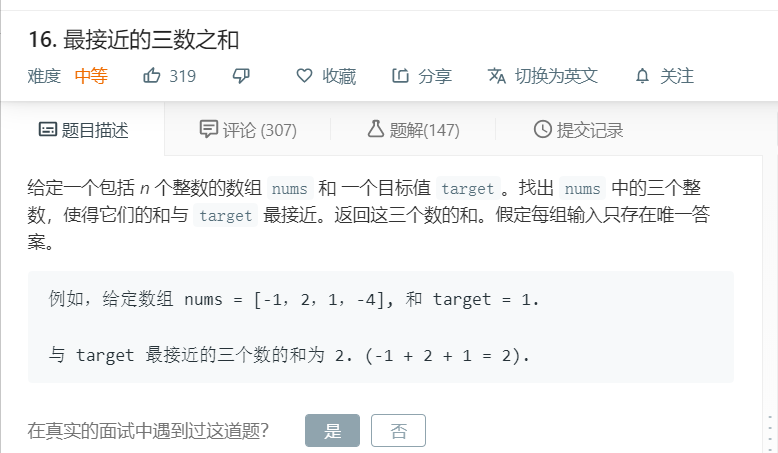

# 16.最接近的三数之和
  

```
/**
 * @param {number[]} nums
 * @param {number} target
 * @return {number}
 */
var threeSumClosest = function(nums, target) {
    if(nums.length < 3){
        return null;
    }
    
    nums.sort((a,b)=>a-b);

    let one = nums[0]+nums[1]+nums[2];

    for(let i=0;i<nums.length-2;i++){
        let start = i+1,end=nums.length-1;
        while(start<end){
            let temp = nums[i] + nums[start] + nums[end];
            if(temp == target){
                return temp;
            }else if(Math.abs(target - one) > Math.abs(target-temp)){
                one = temp;
            }

            if(target > temp){
                start++;
            }else{
                end--;
            }
        }
    }

    return one;
};
```