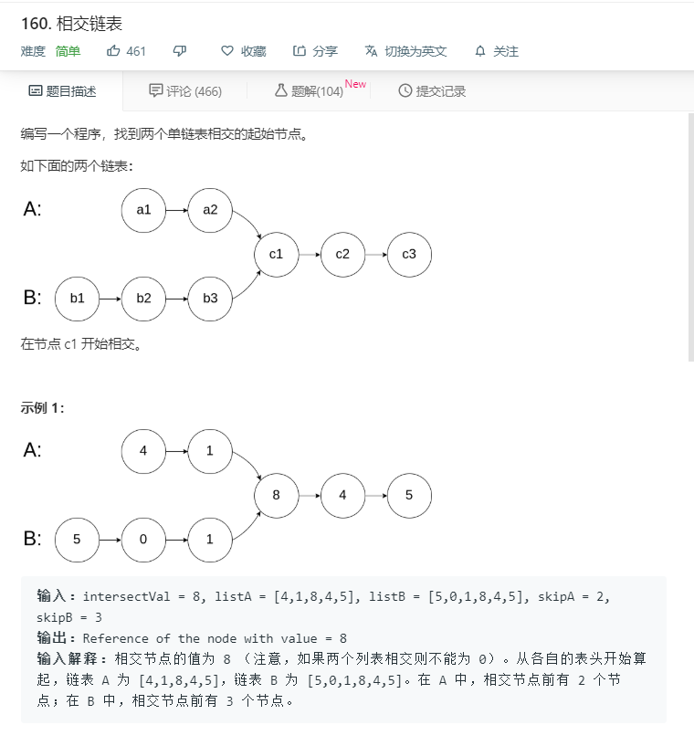
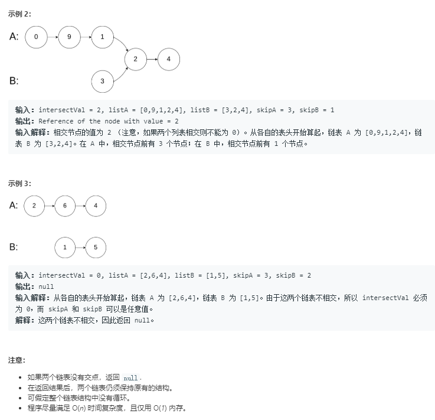

# 160.相交链表
  

  

```
/**
 * Definition for singly-linked list.
 * function ListNode(val) {
 *     this.val = val;
 *     this.next = null;
 * }
 */

/**
 * @param {ListNode} headA
 * @param {ListNode} headB
 * @return {ListNode}
 */
var getIntersectionNode = function(headA, headB) {
   while(headA){
        let tempb = headB;
        while(tempb){
            if(tempb == headA){
               return tempb;
           }else{
               tempb = tempb.next;
           }
       }
       headA = headA.next;
   }
   return null;
};
```

## 双指针法
```
var getIntersectionNode = function(headA, headB){
    let pA = headA;
    let pB = headB;
    while(pA !== pB){
        pB = pB ? pB.next : headA;
        pA = pA ? pA.next : headB;
    }
    return pA;
}
```