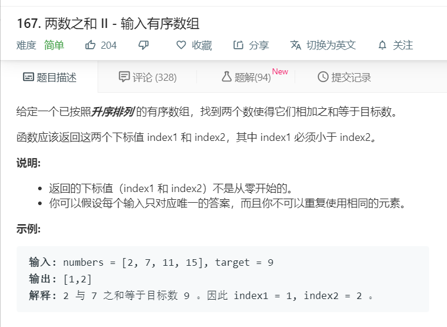

# 167.两数之和II-输入有序数组
  

```
/**
 * @param {number[]} numbers
 * @param {number} target
 * @return {number[]}
 */
var twoSum = function(numbers, target) {
    for(let i=0;i<numbers.length-1;i++){
        let temp = target - numbers[i];
        for(let j = i+1;j<numbers.length;j++){
            if(numbers[j] == temp){
                return [i+1,j+1];
            }
        }
    }
};
```

```
/**
 * @param {number[]} numbers
 * @param {number} target
 * @return {number[]}
 */
var twoSum = function(numbers, target) {
    let one=0,two=numbers.length-1;
    for(let i=0;i<numbers.length;i++){
        if(numbers[one]+numbers[two] > target){
            two--;
        }else if(numbers[one]+numbers[two] < target){
            one++;
        }else{
            return [one+1,two+1];
        }
    }
    
};
```