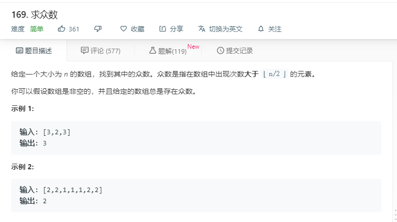

# 169求众数
  

```
/**
 * @param {number[]} nums
 * @return {number}
 */
var majorityElement = function(nums) {
	let len = nums.length >> 1;
    let temp = [];
    nums.forEach(function(ele){
        if(temp.indexOf(ele)<0){
            temp.push(ele);
        }
    })

    let result = [];
    temp.forEach(function(ele){
        let num = 0;
        for(let i=0;i<nums.length;i++){
            if(ele == nums[i]){
                num+=1;
            }
        }
        if(num>len){
            result.push(ele);
        }
	})
	console.log(result);
    return result[0];
};
```