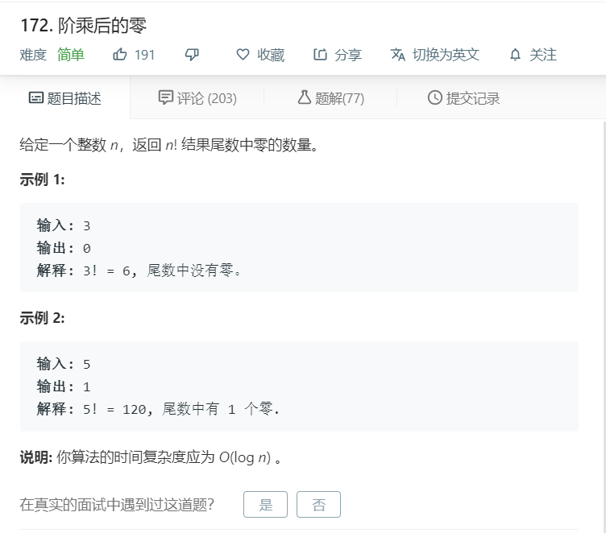

# 172.阶乘后的零
  

```
/**
 * @param {number} n
 * @return {number}
 */
var trailingZeroes = function(n) {
    let temp = 0;
    if(n < 5){
        return 0;
    }else{
        while(n >= 5){
            n = Math.floor(n/5);
            temp += n;
        }
    }

    return temp;
};
```