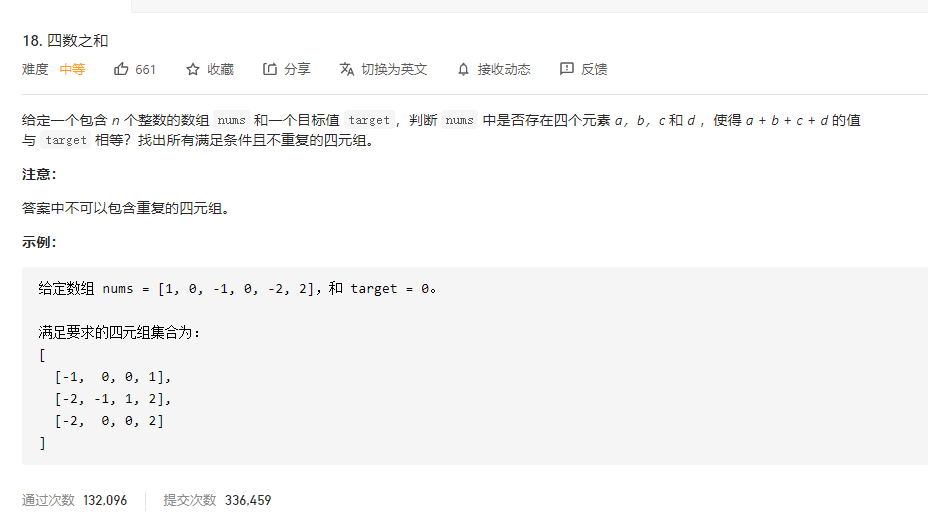

# 18.四数之和
  

```
/**
 * @param {number[]} nums
 * @param {number} target
 * @return {number[][]}
 */
var fourSum = function(nums, target) {
    let res = [], only = new Set();

    nums.sort((a,b) => a-b);

    nums.map((el, index) => {
        for (let i=index + 1;i<nums.length;i++) {
            let a = i+1, b = nums.length - 1;

            while (a < b) {
            let now = el + nums[i] + nums[a] + nums[b];
            if (now < target) {
                a++;
            } else if (now > target){
                b--;
            } else {
                let aboutOnly = el + '*' + nums[i] + '*' + nums[a] + '*' + nums[b];
                if (!only.has(aboutOnly)) {
                    res.push([el,nums[i], nums[a], nums[b]]);
                    only.add(aboutOnly);
                }
                a++;
                b--;
            } 
        }
        }
    })

    return res;
};
```