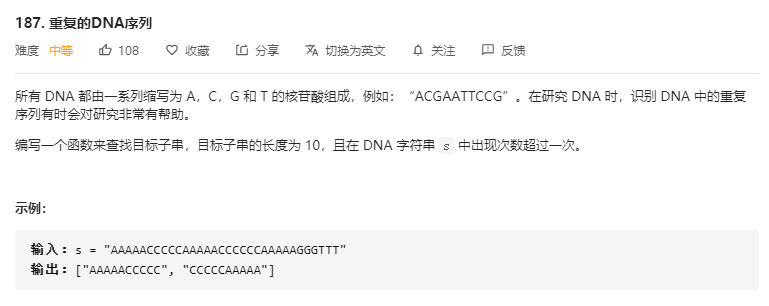

# 187.重复的DNA序列
  

```
/**
 * @param {string} s
 * @return {string[]}
 */
var findRepeatedDnaSequences = function(s) {
    let res = [], map = new Map();
    for(let i=0;i<s.length;i++) {
        if(i + 10 <= s.length) {
            let temp = s.substring(i, i+10);
            
            // console.log(map);
            if(map.has(temp)) {
                if(map.get(temp) === 1) {
                    res.push(temp);
                }
                map.set(temp, map.get(temp) + 1);
            }else {
                map.set(temp, 1);
            }
        }
    }

    // console.log(map);

    return res;
};
```