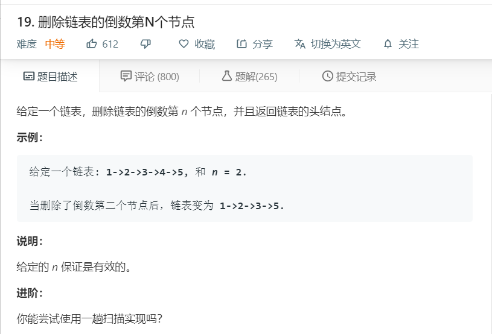

# 19.删除链表的倒数第N个节点
  

```
/**
 * Definition for singly-linked list.
 * function ListNode(val) {
 *     this.val = val;
 *     this.next = null;
 * }
 */
/**
 * @param {ListNode} head
 * @param {number} n
 * @return {ListNode}
 */
var removeNthFromEnd = function(head, n) {
    let temp = [],one = head;
    while(head){
        temp.push(head);
        head = head.next;
    }
    if(temp[temp.length-n] == temp[0]){
        return temp[0].next;
    }
    temp[temp.length-n-1].next = temp[temp.length-n+1];
    return temp[0];
};
```