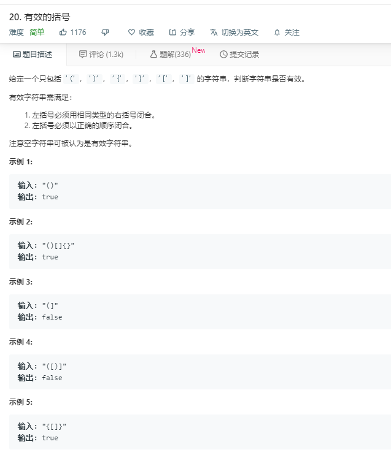

# 20.有效的括号
  

### 暴力破解
效率过低
```
/**
 * @param {string} s
 * @return {boolean}
 */
var isValid = function(s) {

  while(s.split('()').length>1 || s.split('[]').length>1 || s.split('{}').length>1){
    if(s.split('()').length>1){
      s = s.replace('()','');
    }else if(s.split('[]').length>1){
      s = s.replace('[]','');
    }else{
      s = s.replace('{}','');
    }
  }
   if(s.length == 0){
       return true;
   }else{
       return false;
   }
};
```

## 利用栈的思想
```
var isValid = function(s) {
    let mate = {
        '(':')',
        '[':']',
        '{':'}'
    };

    let temp = [];
    let arr = s.split('');
    for(let i=0;i<arr.length;i++){
        if(mate[temp[temp.length-1]] == arr[i]){
            temp.pop();
        }else{
            temp.push(arr[i]);
        }
    }
    if(temp.length > 0){
        return false;
    }else{
        return true;
    }
};

```