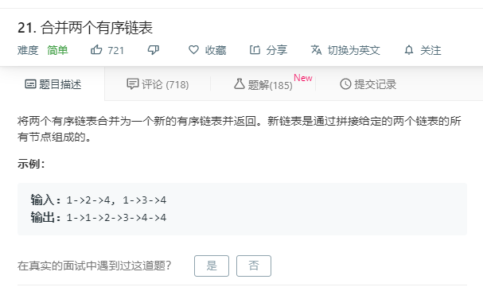

# 21.合并两个有序链表
  

## 数组实现
```
/**
 * Definition for singly-linked list.
 * function ListNode(val) {
 *     this.val = val;
 *     this.next = null;
 * }
 */
/**
 * @param {ListNode} l1
 * @param {ListNode} l2
 * @return {ListNode}
 */
var mergeTwoLists = function(l1, l2) {
    if(!l1 && !l2){
        return l1;
    }
    let temp = [];
    while(l1 && l2){
        if(l1.val < l2.val){
            temp.push(l1);
            l1 = l1.next;
        }else{
            temp.push(l2);
            l2 = l2.next;
        }
    }

    if(l1){
        temp.push(l1);
    }
    if(l2){
        temp.push(l2);
    }

    for(let i=0;i<temp.length-1;i++){
        temp[i].next = temp[i+1];
    }
    return temp[0];
};
```

## 指针
```
/**
 * Definition for singly-linked list.
 * function ListNode(val) {
 *     this.val = val;
 *     this.next = null;
 * }
 */
/**
 * @param {ListNode} l1
 * @param {ListNode} l2
 * @return {ListNode}
 */
var mergeTwoLists = function(l1, l2) {
    let head = new ListNode();
    let mynext = head;

    while(l1 && l2) {
        if(l1.val < l2.val) {
            mynext.next = l1;
            l1 = l1.next;
        }else {
            mynext.next = l2;
            l2 = l2.next;
        }

        mynext = mynext.next;
    }

    mynext.next = l1 == null ? l2 : l1;

    return head.next;
};
```