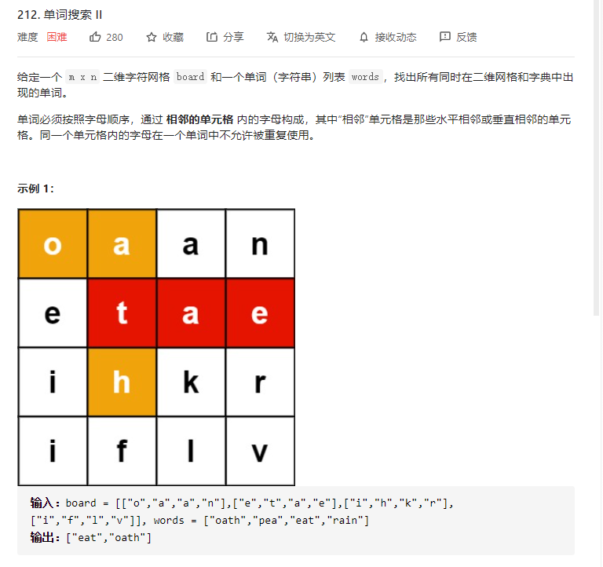
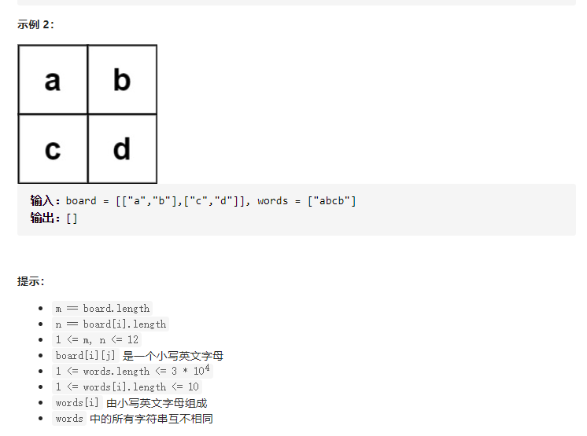

# 212.单词搜索II
  



```
/**
 * @param {character[][]} board
 * @param {string[]} words
 * @return {string[]}
 */
var findWords = function(board, words) {
    let res = new Set();

    let toX = [-1, 0, 1, 0], toY = [0, -1, 0, 1], lenX = board.length, lenY = board[0].length;

    const mid = (nowBoard, x, y, nowWords, start) => {
        // console.log(nowBoard, x, y, nowWords, start)
        if (nowWords.length === 0 ||(nowBoard[x][y] === nowWords[0] && nowWords.length === 1)) {
            res.add(start);
            return;
        }

        if (nowBoard[x][y] != nowWords[0]) {
            return;
        }

        nowBoard[x][y] = '*';

        for (let i=0;i<toX.length;i++) {
            let nowX = x + toX[i], nowY = y + toY[i];
            // console.log(nowX >= 0 && nowX < lenX && nowY >= 0 && nowY < lenY && nowBoard[nowX][nowY] != '*')
            if (nowX >= 0 && nowX < lenX && nowY >= 0 && nowY < lenY && nowBoard[nowX][nowY] != '*') {
                mid(nowBoard, nowX, nowY, nowWords.slice(1), start);
            }
        }
    }

    words.map((el) => {
        let nowWords = el.split('');
        for (let i=0;i<lenX;i++) {
            for (let j=0;j<lenY;j++) {
                let nowBoadr = JSON.parse(JSON.stringify(board));
                mid(nowBoadr, i, j, nowWords, el);
            }
        }
    })

    console.log(res);

    let allRes = [];
    for (let i of res) {
        allRes.push(i);
    }

    return allRes;
};
```