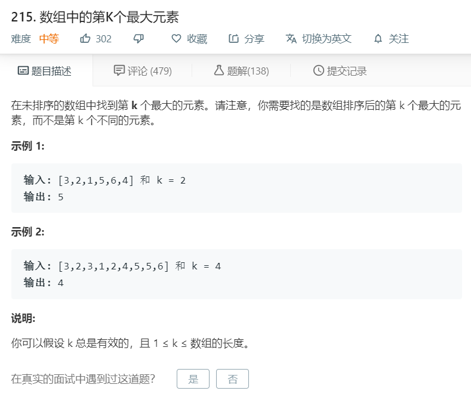

# 215.数组中的第k个最大元素
  

```
/**
 * @param {number[]} nums
 * @param {number} k
 * @return {number}
 */
var findKthLargest = function(nums, k) {
    nums.sort((a,b)=>a-b);
    return nums[nums.length-k];
};
```