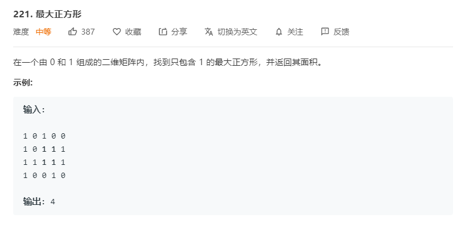

# 221.最大正方形
  

```
/**
 * @param {character[][]} matrix
 * @return {number}
 */
var maximalSquare = function(matrix) {
    let one = [],m = matrix.length, n = matrix[0];

    matrix.map((el,index) => {
        el.map((el,indexs) => {
            if(el == 1) {
                one.push([index,indexs]);
            }
        })
    })

    if( one.length == 0){
        return 0;
    }

    // console.log(one);

    let result = [1];

    let mid = (x,y,start,res) => {
        console.log(x,y,start)
        if(x >= m || y >= n) {
            return false;
        }
        
        for(let i = start[0];i <= x;i++){
            if(i >= m || matrix[i][y] != 1){
                return false;
            }
        }

        for(let i=start[1];i<=y;i++){
            if(i>=n || matrix[x][i] != 1){
                return false;
            }
        }

        result.push(res + 1);
        mid(x + 1,y + 1,start,res + 1);
    }

    one.map((el) => {
        mid(el[0] + 1,el[1] + 1,el,1);
    })

    console.log(result)
    return Math.pow(Math.max(...result),2);
};
```