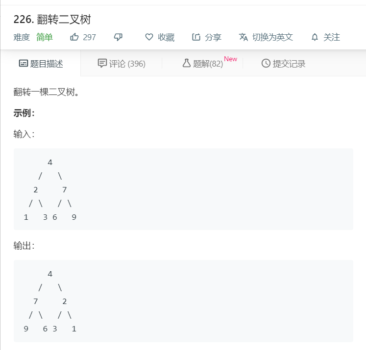

# 226.翻转二叉树
  

```
/**
 * Definition for a binary tree node.
 * function TreeNode(val) {
 *     this.val = val;
 *     this.left = this.right = null;
 * }
 */
/**
 * @param {TreeNode} root
 * @return {TreeNode}
 */
var invertTree = function(root) {
    while(root){
            if(root.left && root.right){
                let templeft = root.left;
                let tempright = root.right;
                [root.left,root.right] = [root.right,root.left];
                invertTree(templeft);
                invertTree(tempright);
            }else if(root.left){
                root.right = root.left;
                root.left = null;
                invertTree(root.right);
            }else{
                root.left = root.right;
                root.right = null;
                invertTree(root.left);
            }
            return root;
    }
    return root;
};
```