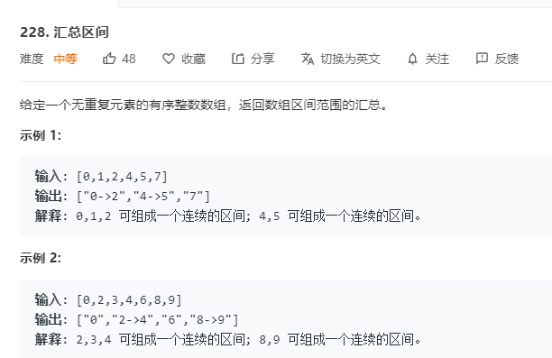

# 228.汇总区间
  

```
/**
 * @param {number[]} nums
 * @return {string[]}
 */
var summaryRanges = function(nums) {
    let result = [],temp = [];

    for(let i=0;i<nums.length;i++) {
        if(temp.length == 0 || temp[temp.length-1] == nums[i] - 1) {
            temp.push(nums[i]);
        }else {
            result.push(temp);
            temp = [];
            temp.push(nums[i]);
        }
        if(i == nums.length - 1) {
            result.push(temp);
        }
    }

    console.log(result);
    result.map((el,index) => {
        if(el.length == 1) {
            result[index] = el[0] + '';
        }else {
            result[index] = el[0] + '->' + el[el.length-1];
        }
    })

    console.log(result);
    return result;
};
```