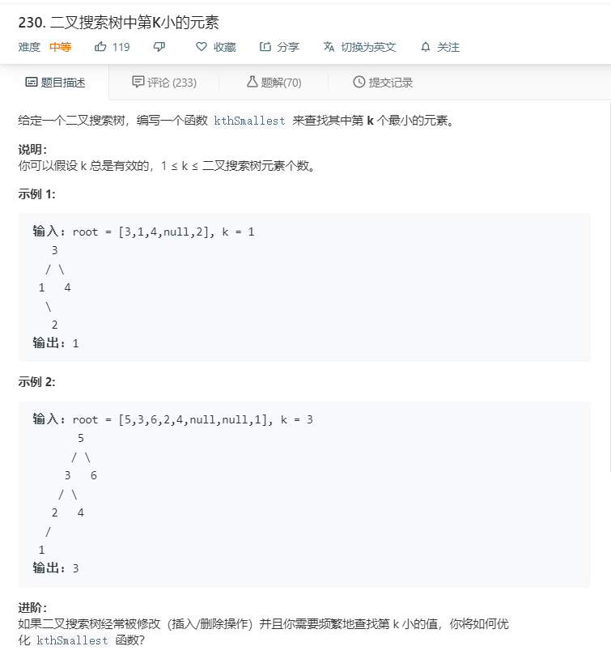

# 230.二叉搜索树中第k小的元素
  

```
/**
 * Definition for a binary tree node.
 * function TreeNode(val) {
 *     this.val = val;
 *     this.left = this.right = null;
 * }
 */
/**
 * @param {TreeNode} root
 * @param {number} k
 * @return {number}
 */
var kthSmallest = function(root, k) {
    let temp = [];
  function mid(r){
      if(r){
          mid(r.left);
          temp.push(r.val);
          mid(r.right);
      }
  }  

  mid(root);

  return temp[k-1];
};
```