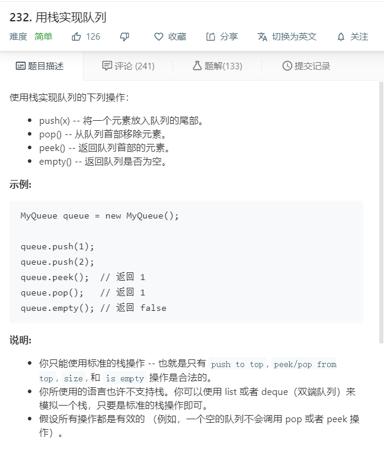

# 232.用栈实现队列
  

```
/**
 * Initialize your data structure here.
 */
var MyQueue = function() {
    this.temp = [];
};

/**
 * Push element x to the back of queue. 
 * @param {number} x
 * @return {void}
 */
MyQueue.prototype.push = function(x) {
    this.temp[this.temp.length] = x;
};

/**
 * Removes the element from in front of queue and returns that element.
 * @return {number}
 */
MyQueue.prototype.pop = function() {
    let one = [];
    for(let i=1;i<this.temp.length;i++){
        one.push(this.temp[i]);
    }
    let two = this.temp[0];
    this.temp = one;
    return two;
};

/**
 * Get the front element.
 * @return {number}
 */
MyQueue.prototype.peek = function() {
    return this.temp[0];
};

/**
 * Returns whether the queue is empty.
 * @return {boolean}
 */
MyQueue.prototype.empty = function() {
    if(this.temp.length <= 0){
        return true;
    }else{
        return false;
    }
};

/**
 * Your MyQueue object will be instantiated and called as such:
 * var obj = new MyQueue()
 * obj.push(x)
 * var param_2 = obj.pop()
 * var param_3 = obj.peek()
 * var param_4 = obj.empty()
 */
```