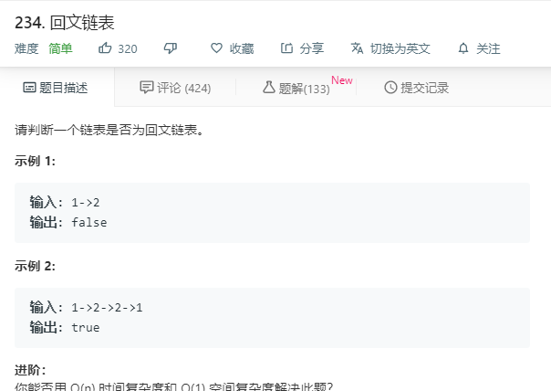

# 234.回文链表
  

```
/**
 * Definition for singly-linked list.
 * function ListNode(val) {
 *     this.val = val;
 *     this.next = null;
 * }
 */
/**
 * @param {ListNode} head
 * @return {boolean}
 */
var isPalindrome = function(head) {
    let temp = [];
    while(head){
        temp.push(head);
        head = head.next;
    }

    if(temp.length <= 1){
        return true;
    }
    let num = temp.length >> 1;
    console.log(num);
    for(let i=0;i<=num;i++){
        if(temp[i].val != temp[temp.length-1-i].val){
            return false;
        }
    }
    return true;
};
```