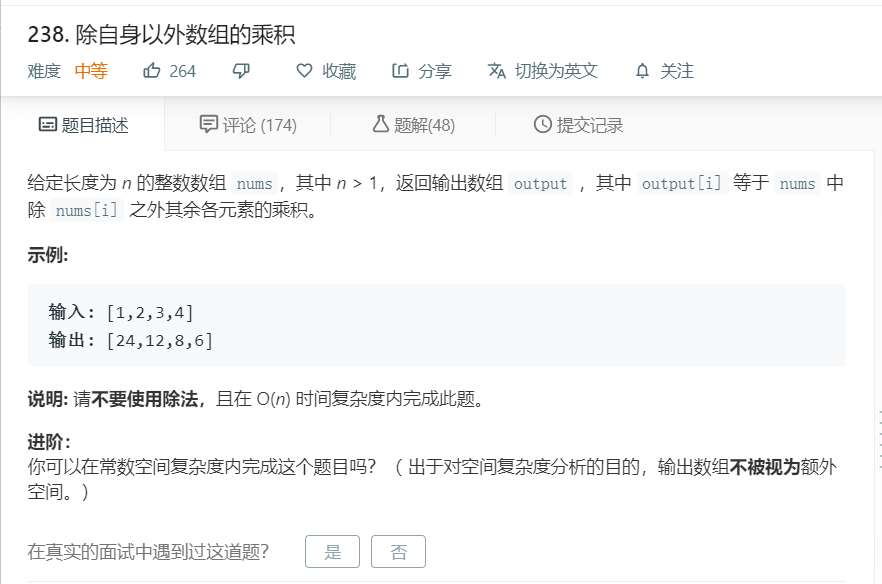

# 238.除自身以外数组的乘积
  

```
/**
 * @param {number[]} nums
 * @return {number[]}
 */
var productExceptSelf = function(nums) {
    let temp = [],k=1,res=[];
    for(let i=0;i<nums.length;i++){
        temp[i] = k;
        k *= nums[i];
    }

    k = 1;
    for(let i=nums.length-1;i>=0;i--){
        res[i] = k;
        k *= nums[i];
    }

    for(let i=0;i<nums.length;i++){
        nums[i] = temp[i]*res[i];
    }

    return nums;


};
```