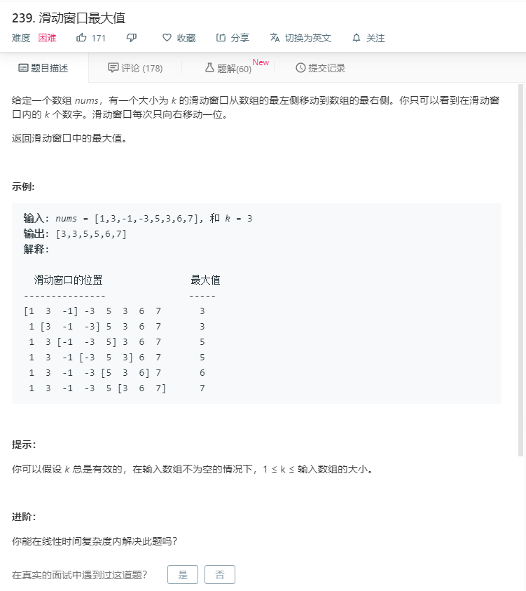

# 239.滑动窗口最大值
  

## 双循环暴力破解
```
/**
 * @param {number[]} nums
 * @param {number} k
 * @return {number[]}
 */
var maxSlidingWindow = function(nums, k) {
    if(nums.length == 0){
        return [];
    }
  let result = [];
  for(let i=0;i<nums.length-k+1;i++){
      let temp = [];
      for(let j=i;j<i+k;j++){
          temp.push(nums[j]);
      }
      // console.log(Math.max.apply(null,temp));
      result.push(Math.max.apply(null,temp));
  }
  return result;
};
```

## 方法二
```
var maxSlidingWindow = function(nums, k) {
    if(nums.length == 0){
        return [];
    }
  let result = [];
  for(let i=0;i<nums.length-k+1;i++){
    let temp = [];
    temp = nums.slice(i,i+k);
    result.push(Math.max.apply(null,temp));
  }
  // console.log(result);
  return result;
};

```