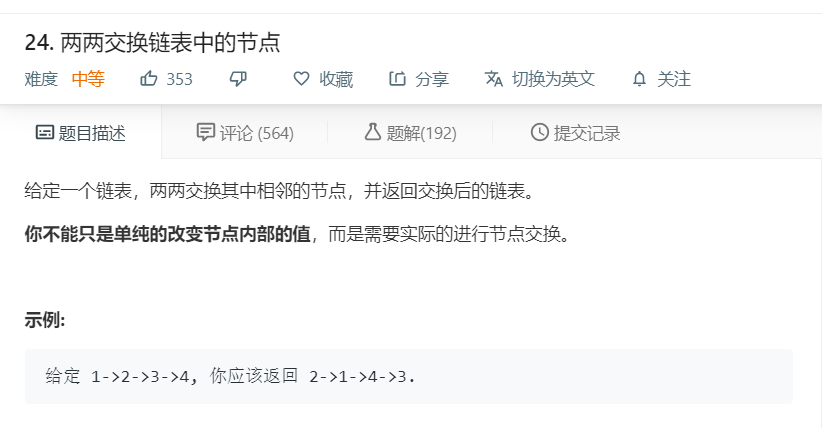

# 24.两两交换链表中的节点
  

```
/**
 * Definition for singly-linked list.
 * function ListNode(val) {
 *     this.val = val;
 *     this.next = null;
 * }
 */
/**
 * @param {ListNode} head
 * @return {ListNode}
 */
var swapPairs = function(head) {
    if(!head){
        return head;
    }
    let temp = [];
    while(head){
        temp.push(head);
        head = head.next;
    }

    for(let i=0;i<temp.length-1;i=i+2){
        [temp[i],temp[i+1]] = [temp[i+1],temp[i]];
    }

    for(let i=0;i<temp.length;i++){
        if(i == temp.length-1){
            temp[i].next = null;
        }
        temp[i].next = temp[i+1];
    }
    return temp[0];
};
```