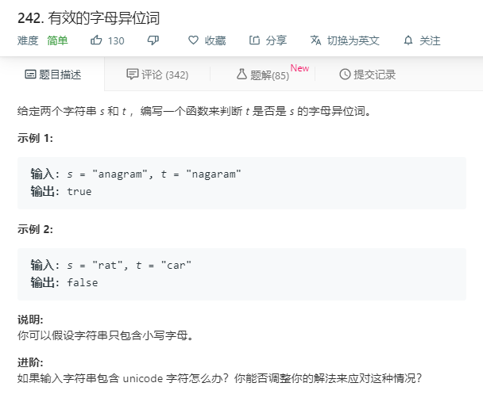

# 242.有效的字母异位词
  

```
/**
 * @param {string} s
 * @param {string} t
 * @return {boolean}
 */
var isAnagram = function(s, t) {
    let one = s.split('').sort();
    let two = t.split('').sort();
    console.log(one,two);
    if(one.length != two.length){
      return false;
    }
    let ft = 0;
    one.map((key,value)=>{
      // console.log(key,value,two[value]);
      if(key !== two[value]){
        ft = 1;
      }
    })

    if(ft == 1){
      return false;
    }
    return true;
};


```