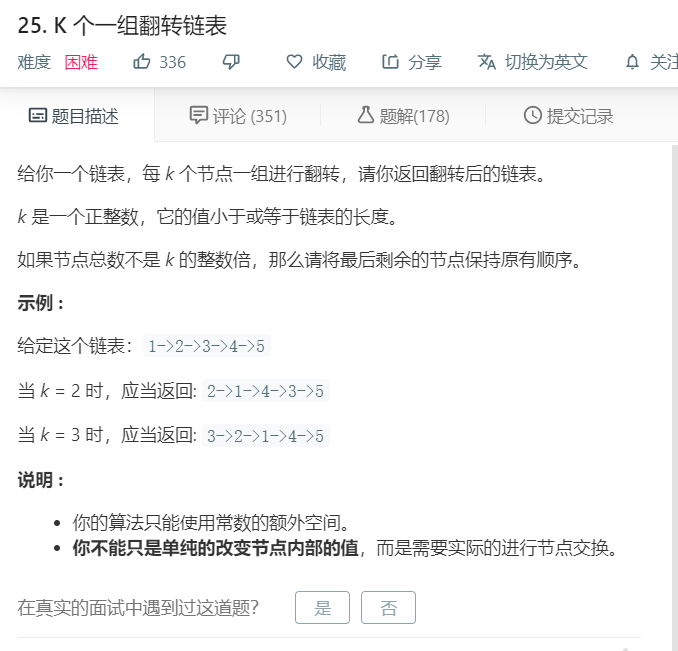

# 25.K个一组翻转链表
  

```
/**
 * Definition for singly-linked list.
 * function ListNode(val) {
 *     this.val = val;
 *     this.next = null;
 * }
 */
/**
 * @param {ListNode} head
 * @param {number} k
 * @return {ListNode}
 */
var reverseKGroup = function(head, k) {
    if(!head){
        return head;
    }

    let temp = [];
    while(head){
     temp.push(head);
     head = head.next;   
    }
    let temptwo = [];
    while(temp){
        if(temp.length >= k){
            let now = temp.splice(0,k);
            now.reverse();
            now.forEach((el)=>{
                temptwo.push(el);
            })
        }else{
            temp.forEach((el)=>{
                temptwo.push(el);
            })
            temp = null;
        }
    }

    for(let i=0;i<temptwo.length;i++){
        if(i == temptwo.length-1){
            temptwo[i].next = null;
        }else{
            temptwo[i].next = temptwo[i+1];
        }
    }

    return temptwo[0];
};
```