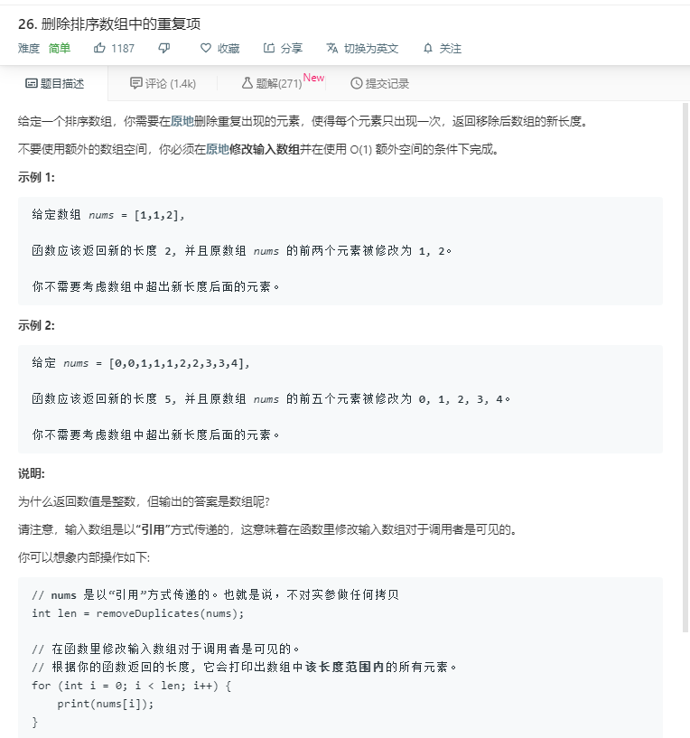

# 26.删除排序数组中的重复项


```
/**
 * @param {number[]} nums
 * @return {number}
 */
var removeDuplicates = function(nums) {
  for(let i = 0;i<nums.length-1;i++){
      if(nums[i+1] == nums[i]){
        nums.splice(i+1,1);
        i -= 1;
      }
  }
  // console.log(nums);
  return nums.length;
};
```