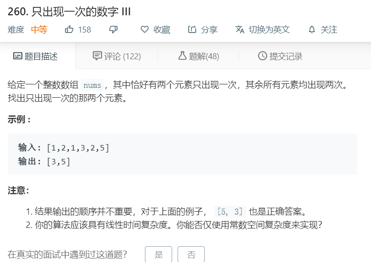

# 260.只出现一次的数字III
  

```
/**
 * @param {number[]} nums
 * @return {number[]}
 */
var singleNumber = function(nums) {
    let result = [];
    for(let i=0;i<nums.length;i++){
        if(nums.indexOf(nums[i]) == nums.lastIndexOf(nums[i]) && result.indexOf(nums[i])<0){
            result.push(nums[i]);
            if(result.length == 2){
                return result;
            }
        }
    }
};
```