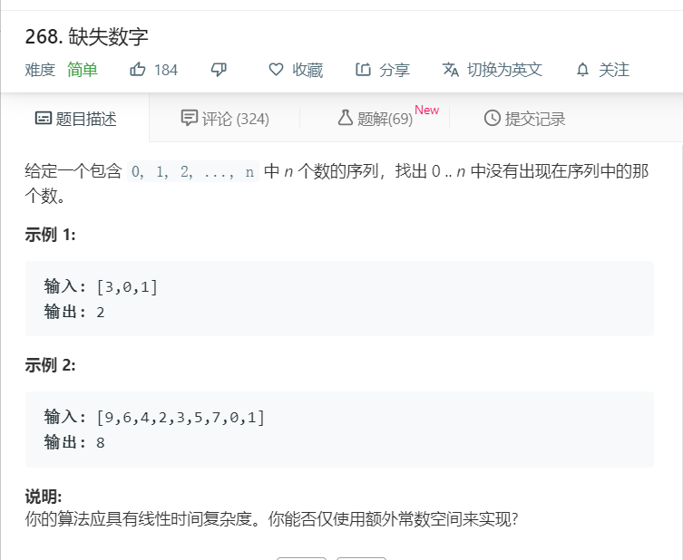

# 268.缺失数字
  

```
/**
 * @param {number[]} nums
 * @return {number}
 */
var missingNumber = function(nums) {
    nums.sort((a,b)=>a-b);
    for(let i=0;i<nums.length;i++){
      if(nums[i] != i){
        console.log(i);
        return i;
      }
    }
    return nums.length;
};
```