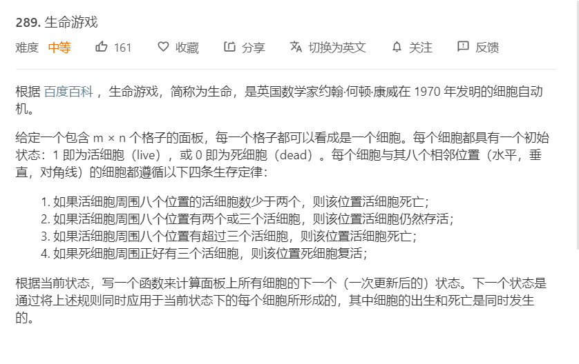
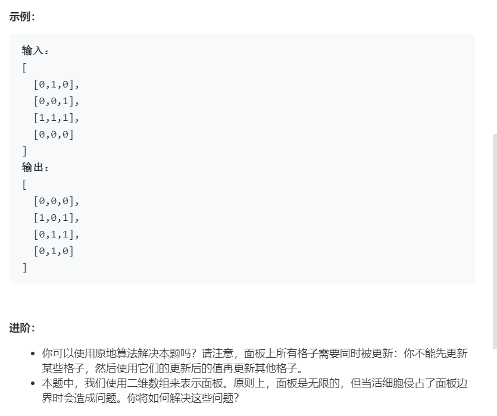

# 289.生命游戏
  

  

```
/**
 * @param {number[][]} board
 * @return {void} Do not return anything, modify board in-place instead.
 */
var gameOfLife = function(board) {
    let mate = [
        [-1,-1],
        [0,-1],
        [1,-1],
        [-1,0],
        [1,0],
        [-1,1],
        [0,1],
        [1,1]
    ],
    m = board.length,n = board[0].length,
    result = [];

    let boards = board.map((el)=>{
        return [...el];
    })

    // console.log(boards);

    let one = (i,j,who) => {
        let num = 0;
        for(let e = 0;e < mate.length;e++){
            // console.log([i,j],[mate[e][0]+i,mate[e][1]+j])
            if(mate[e][0] + i >= 0 && mate[e][0] + i < m 
                && mate[e][1] + j >= 0 && mate[e][1] + j < n
                && board[mate[e][0]+i][mate[e][1]+j] == 1){
                // console.log([i,j],[mate[e][0]+i,mate[e][1]+j],board[mate[e][0]+i][mate[e][1]+j])
                num++ ;
            }
        }
        if(who == 0){
            if(num == 3){
                return 1;
            }else{
                return 0;
            }
        }else{
            if(num == 2 || num == 3){
                return 1;
            }else{
                return 0;
            }
        } 
    }

    for(let i=0;i<m;i++){
        for(let j=0;j<n;j++){
            boards[i][j] = one(i,j,board[i][j]);
            // console.log(i,j,one(i,j,board[i][j]));
        }
    }

    boards.map((el,index)=>{
        board[index] = [...el];
    })
};

```