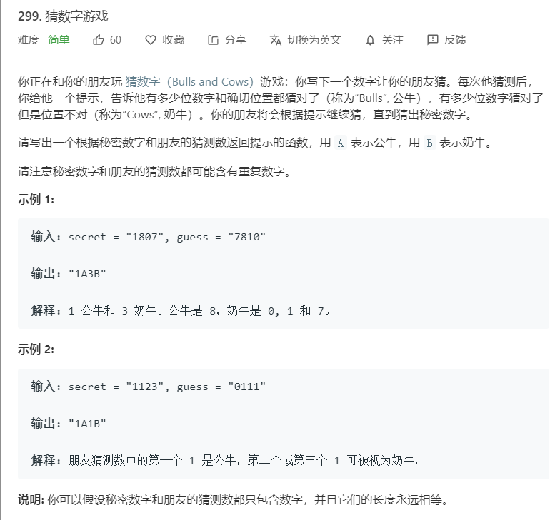

# 299.猜数字游戏
  

```
/**
 * @param {string} secret
 * @param {string} guess
 * @return {string}
 */
var getHint = function(secret, guess) {
    let one = 0,two = 0;
    secret = (secret + '').split('');
    guess = (guess + '').split('');

    for(let i=0;i<guess.length;i++){
        if(guess[i] == secret[i]){
            one++;
            secret.splice(i,1);
            guess.splice(i,1);
            i--;
        }
    }

    for(let i=0;i<guess.length;i++){
        let temp = secret.indexOf(guess[i]);
        if(temp >= 0){
            two++;
            secret.splice(temp,1)
        }
    }

    return one + 'A' + two + 'B';
};
```