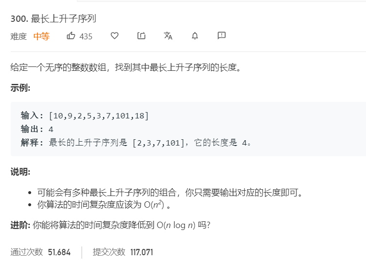

# 300.最长上升子序列
  

```
/**
 * @param {number[]} nums
 * @return {number}
 */
var lengthOfLIS = function(nums) {
    let length = nums.length;
    if(length == 0){
        return 0;
    }

    let temp = new Array(length).fill(1);
    console.log(temp);

    for(let i=1;i<length;i++){
        for(let j=0;j<i;j++){
            if(nums[i] > nums[j]){
                temp[i] = Math.max(temp[i],temp[j]+1);
            }
        }
    }

    console.log(temp);
    return Math.max(...temp);
};
```