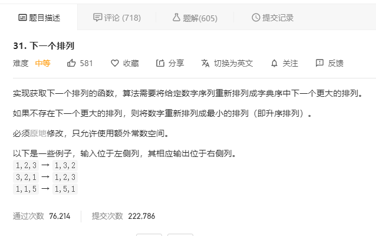
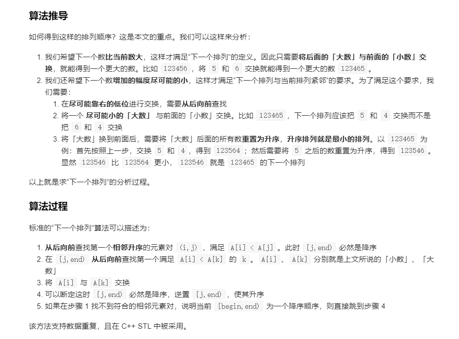

# 31.下一个排列
    



```
/**
 * @param {number[]} nums
 * @return {void} Do not return anything, modify nums in-place instead.
 */
var nextPermutation = function(nums) {
    if(nums.length <= 1) {
        return nums;
    }

    let i = nums.length - 2 , j = nums.length - 1, k = nums.length - 1;

    while(nums[i] >= nums[j] && i > 0) {
        i--;
        j--;
    }

    if(nums[i] >= nums[j]) {
        return nums.sort((a,b)=>a-b);
    }

    while(nums[i] >= nums[k] && k > i) {
        k--;
    }

    [nums[i], nums[k]] = [nums[k], nums[i]];

    for(let ii=j, jj = nums.length - 1; ii < jj;ii++, jj--) {
        [nums[ii], nums[jj]] = [nums[jj], nums[ii]];
    }

    return nums;
};
```