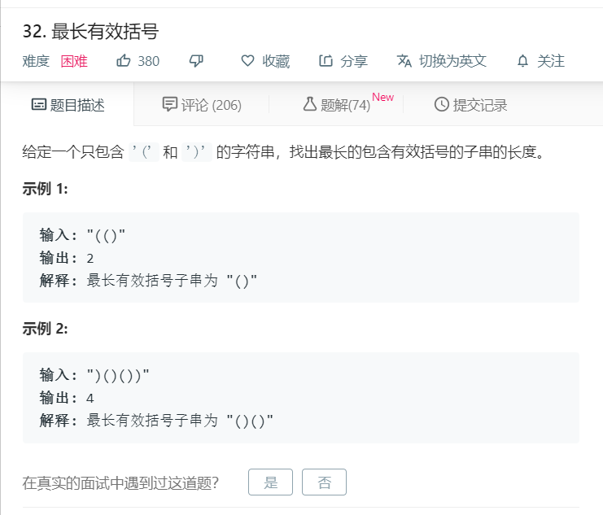

# 32最长有效括号
  

```
/**
 * @param {string} s
 * @return {number}
 */
var longestValidParentheses = function(s) {
  if(s == ""){
    return 0;
  }
  let mate = {
    '(':')',
    '[':']',
    '{':'}'
  };

  let temp = [],result=[];
  let arr = s.split('');
  for(let i=0;i<arr.length;i++){
      if(mate[temp[temp.length-1]] == arr[i]){
          temp.pop();
          result.pop();
      }else{
          temp.push(arr[i]);
          result.push(i);
      }
  }
  if(result[result.length-1] != arr.length-1){
    result.push(arr.length);
  }
  if(result.length == 1){
    return result;
  }
  console.log(result);
  let max = 0;
  for(let i=0;i<result.length;i++){
    if(i==0){
      let temp = result[i] - 0;
      if(temp>max){
        max = temp+1;
      }
    }else{
      let temp = result[i]-result[i-1];
      if(temp>max){
        max = temp;
      }
    }
    
  }
  console.log(max-1);
  return max-1;
};
```