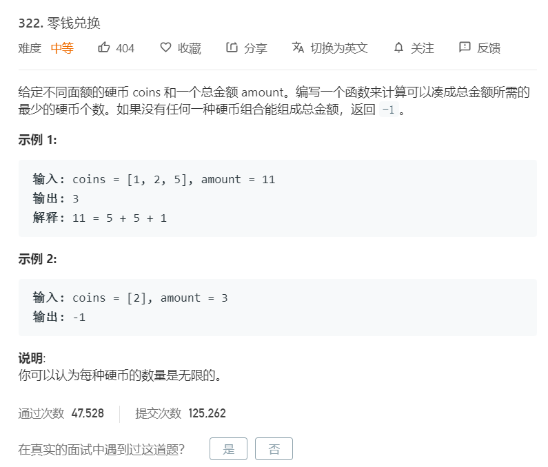

# 322.零钱兑换
  

### 递归(超时)
```
function minCoins(arr,aim){
    if(arr == null || arr.length == 0 || aim < 0){
        return -1;
    }
    return process(arr,0,aim);
}

//当前考虑的面值是arr[i],还剩rest的钱需要找零
//如果返回-1，说明自由使用arr[i...N-1]面值的情况下，无论如何也无法找零rest
//如果返回不是-1，代表自由使用arr[i...N-1]面值的情况下，找零rest需要的最少张数
function process(arr,i,rest){
    //1.已经没有面值能够考虑
    //2.如果此时剩余的钱为0，返回零张
    //3.如果此时剩余的钱不是0，返回-1
    if(i == arr.length){
        return rest == 0 ? 0 : -1;
    }

    //最少张数，初始时为-1，因为还没有找到有效解
    let res = -1;
    //一次尝试使用当前面值(arr[i])0张、1张、k张，但不能超过rest
    for(let k = 0;k*arr[i] <= rest;k++){
        //使用k张arr[i],剩下的钱为rest-k*arr[i]
        //交给剩下的面值去搞定arr[i+1...N-1]
        let next = process(arr,i+1,rest-k*arr[i]);
        if(next != -1){
            //说明这个后续过程有效
            res = res == -1 ? next + k : Math.min(res,next + k);
        }
    }
    return res;
}
```

### 动态规划

```
/**
 * @param {number[]} coins
 * @param {number} amount
 * @return {number}
 */
var coinChange = function(coins, amount) {
    if(coins == null || coins.length == 0 || amount < 0){
        return -1;
    }
    let dp = new Array(amount+1).fill(amount+1);
    dp[0] = 0;
    for(let i=0;i<=amount;i++){
        for(let j=0;j<coins.length;j++){
            if(i >= coins[j]){
                dp[i] = Math.min(dp[i],dp[i-coins[j]]+1);
            }
        }
    }

    //最后比较动态规划的最后一步是否与初始值有变化，有就说明有解，没有则返回-1无解
    return dp[amount] > amount ? -1 : dp[amount];
};

```