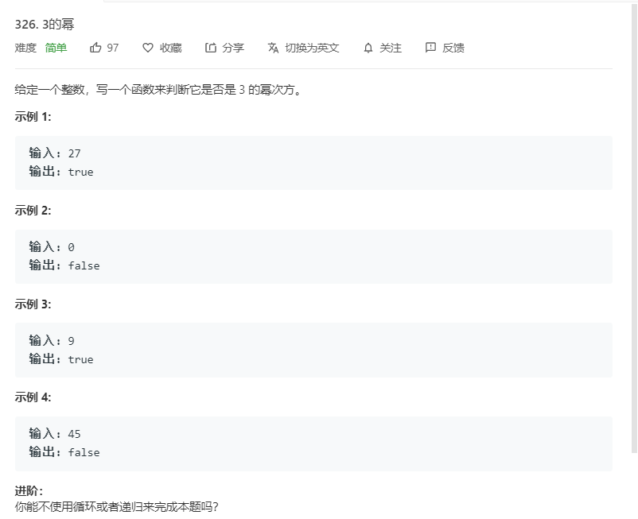

# 326.3的幂
  

```
/**
 * @param {number} n
 * @return {boolean}
 */
var isPowerOfThree = function(n) {
    if(n == 1){
        return true;
    }
    if(n < 3){
        return false;
    }
    let temp = 3;
    while(temp < n){
        temp *= 3;
    }

    if(temp == n){
        return true;
    }else{
        return false
    }
};
```