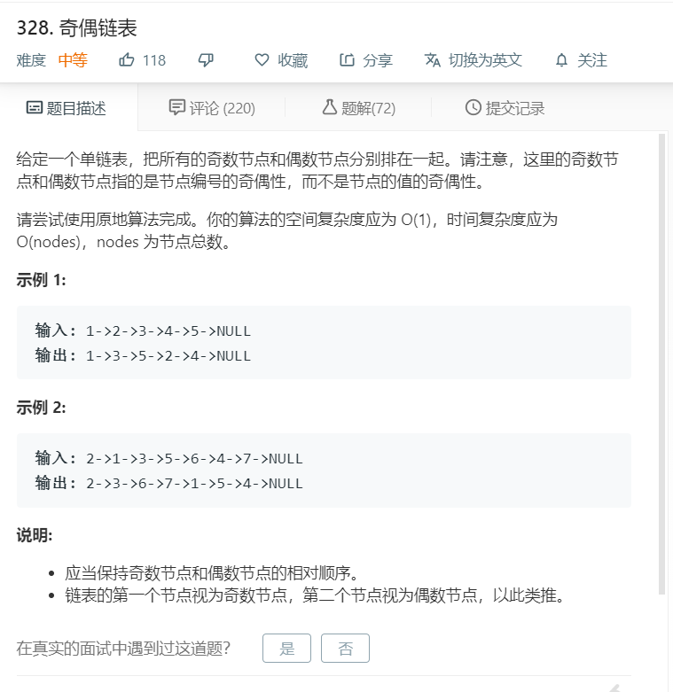

# 328.奇偶链表
  

```
/**
 * Definition for singly-linked list.
 * function ListNode(val) {
 *     this.val = val;
 *     this.next = null;
 * }
 */
/**
 * @param {ListNode} head
 * @return {ListNode}
 */
var oddEvenList = function(head) {
    if(!head){
        return null;
    }
    let temp = [];
    while(head){
        temp.push(head);
        head = head.next;
    }

    let one = [],two = [];
    temp.forEach((el,index)=>{
        if(index % 2 == 0){
            one.push(el);
        }else{
            two.push(el);
        }
    })

    two.forEach((el)=>{
        one.push(el);
    })

    for(let i=0;i<one.length-1;i++){
        one[i].next = one[i+1];
    }

    one[one.length-1].next = null;
    return one[0];
};
```