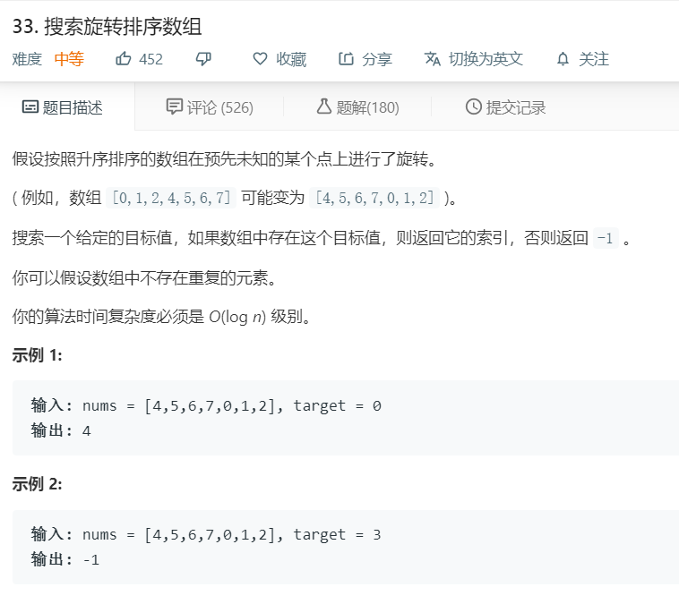

# 33.搜索旋转排序数组
  

```
/**
 * @param {number[]} nums
 * @param {number} target
 * @return {number}
 */
var search = function(nums, target) {
    return nums.indexOf(target);
};
```
## 二分查找
```
var search = function(nums, target) {
    var low = 0;
    var high = nums.length - 1;
    while(low < high){
        var mid = (low+high)>>1;
        if( target < nums[0] && target > nums[mid]){
            low = mid+1;
        }
        else if(nums[0] <= nums[mid] && (target > nums[mid] || target < nums[0])) {
            low = mid+1;
        }
        else{
            high = mid;
        }
    }
    return low == high && nums[low] == target ? low : -1;
};
```