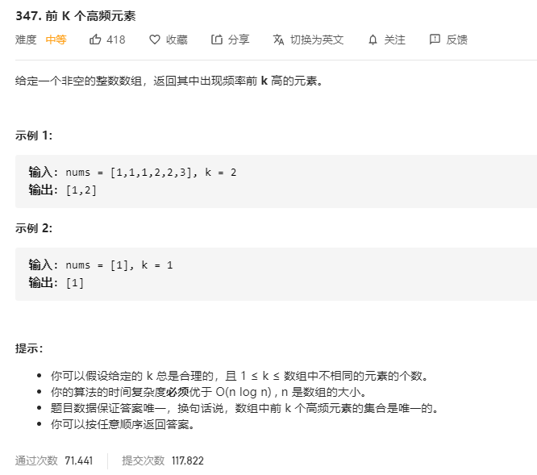

# 347.前K个高频元素
  

```
/**
 * @param {number[]} nums
 * @param {number} k
 * @return {number[]}
 */
var topKFrequent = function(nums, k) {
    let temp = new Map(), arr = [...new Set(nums)];

    nums.map((el) => {
        if(temp.has(el)) {
            temp.set(el, temp.get(el) + 1);
        } else {
            temp.set(el, 1);
        }
    })

    arr.sort((a,b) => temp.get(b)-temp.get(a));

    return arr.slice(0,k);
};
```