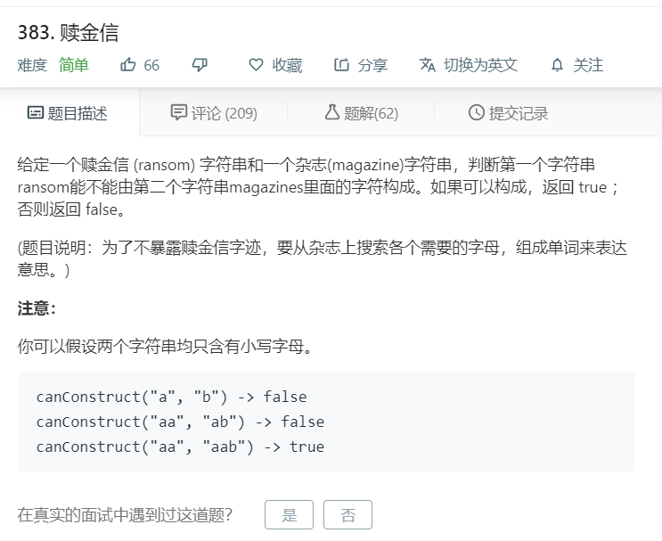

# 383.赎金信.png
  

```
/**
 * @param {string} ransomNote
 * @param {string} magazine
 * @return {boolean}
 */
var canConstruct = function(ransomNote, magazine) {
    if(ransomNote.length == 0){
        return true;
    }
    let a = ransomNote.split('');
    let b = magazine.split('');
    console.log(a,b);
    for(let i = 0;i<a.length;i++){
        if(b.indexOf(a[i]) < 0){
            return false;
        }else{
            b.splice(b.indexOf(a[i]),1);
        }
    }

    return true;
};
```