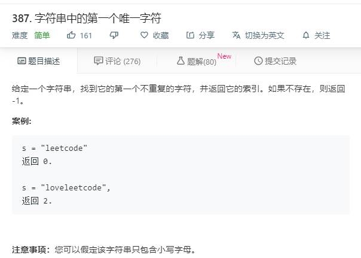

# 387.字符串中的第一个唯一字符
  

```
/**
 * @param {string} s
 * @return {number}
 */
var firstUniqChar = function(s) {
    let temp = s.split('');
    for(let i=0;i<temp.length;i++){
      let swap = temp.slice(0);
      temp.splice(i,1);
      let nowte = temp;
      temp = swap;
    //   console.log(temp,nowte);
      if(!nowte.includes(temp[i])){
        // console.log(i);
        return i;
      }
    }
    return -1;
};

```

```
var firstUniqChar = function(s) {
    for (let i = 0; i < s.length; i++) {
        if (s.indexOf(s[i]) === s.lastIndexOf(s[i])) {
            return i
        }
    }
    return -1
};
```