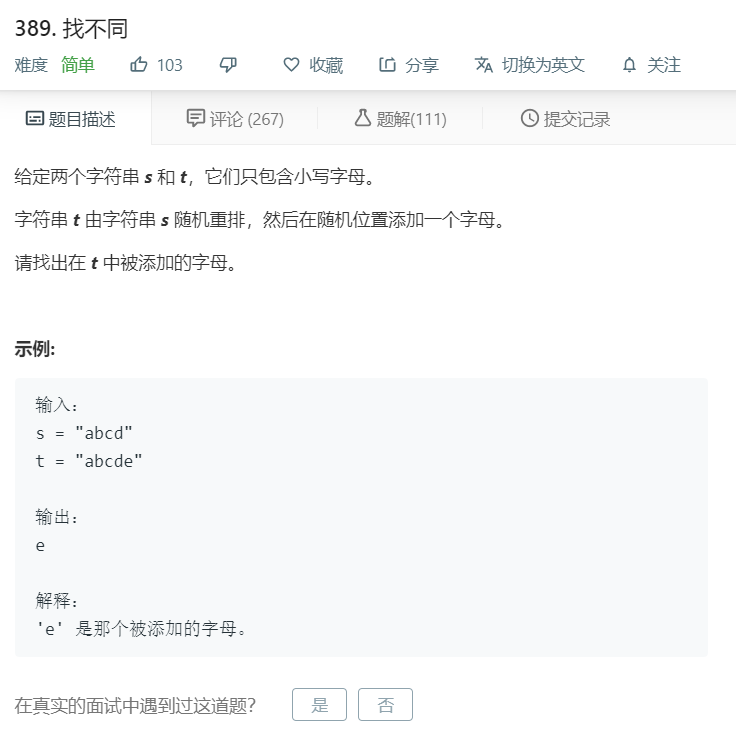

# 389.找不同
  

```
/**
 * @param {string} s
 * @param {string} t
 * @return {character}
 */
var findTheDifference = function(s, t) {
    s = s.split('').sort();
    t = t.split('').sort();

    for(let i = 0;i<s.length;i++){
        if(t[i] != s[i]){
            return t[i];
        }
    }

    return t[t.length-1];
};
```