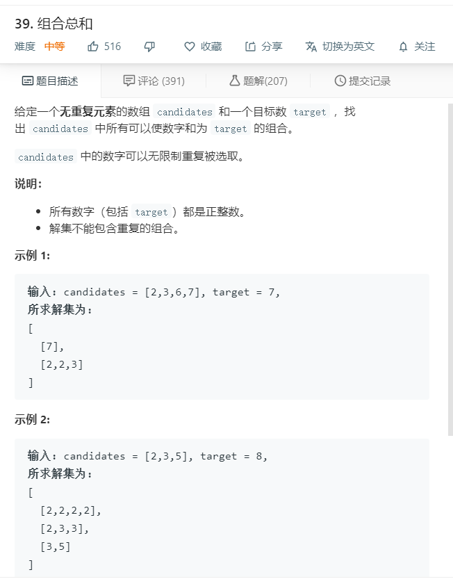

# 39.组合总和
  

```
/**
 * @param {number[]} candidates
 * @param {number} target
 * @return {number[][]}
 */
var combinationSum = function(candidates, target) {
    let temp = [],list=[];
    let getlist = (target,list,start) => {
        if(target < 0){
            return;
        }

        if(target == 0){
            temp.push(list);
            return;
        }

        for(let i=start;i<candidates.length;i++){
            list.push(candidates[i]);
            getlist(target-candidates[i],list.slice(),i);
            list.pop();
        }
    }
    getlist(target,list,0);
    return temp;
};
```