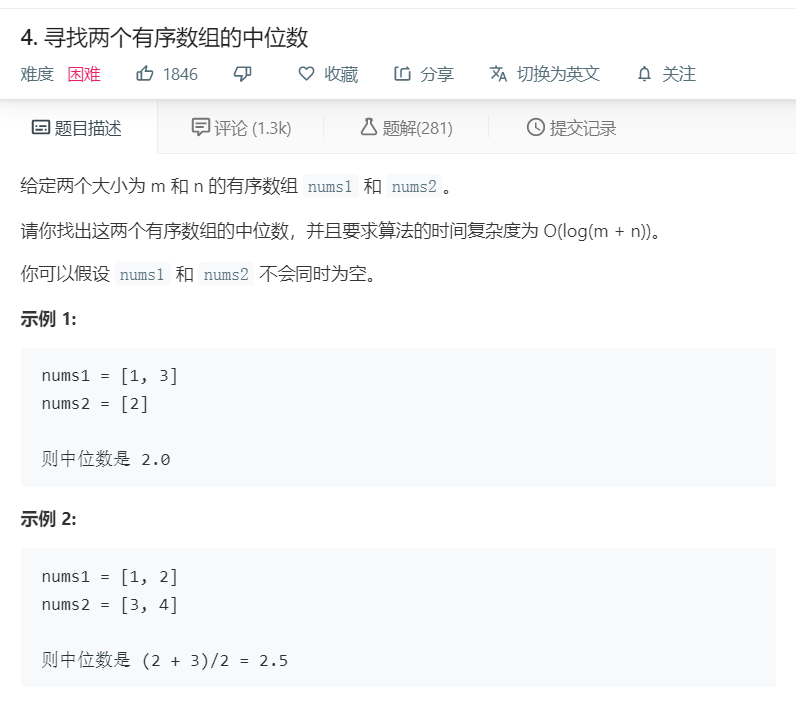

# 4.寻找两个有序数组的中位数
  

```
/**
 * @param {number[]} nums1
 * @param {number[]} nums2
 * @return {number}
 */
var findMedianSortedArrays = function(nums1, nums2) {
    
    let temp = [].concat(nums1).concat(nums2);
    if(temp.length <= 1){
        return temp;
    }
    temp.sort((a,b)=>a-b);
    let num = temp.length >> 1;
    console.log(temp);
    if(temp.length % 2 != 0){
        return temp[num].toFixed(1);
    }else{
        return ((temp[num]+temp[num-1])/2).toFixed(1);
    }
};
```