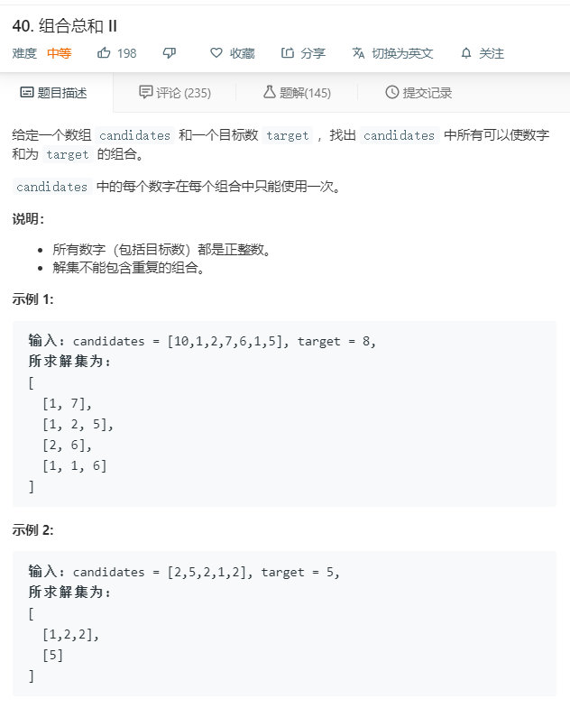

# 40.组合总和II
  

```
/**
 * @param {number[]} candidates
 * @param {number} target
 * @return {number[][]}
 */
var combinationSum2 = function(candidates, target) {
    candidates.sort((a,b)=>a-b);
    let temp = [],list = [];

    let one = (list,target,start) => {
        if(target < 0){
            return;
        }

        if(target == 0){
            temp.push(list);
            return;
        }

        for(let i=start;i<candidates.length;i++){
            list.push(candidates[i]);
            one(list.slice(),target-candidates[i],i+1);
            list.pop();
            while(i+1 <= candidates.length - 1 && candidates[i+1] == candidates[i]){
                i++;
            }
        }
    }

    one(list,target,0);
    return temp;
};
```