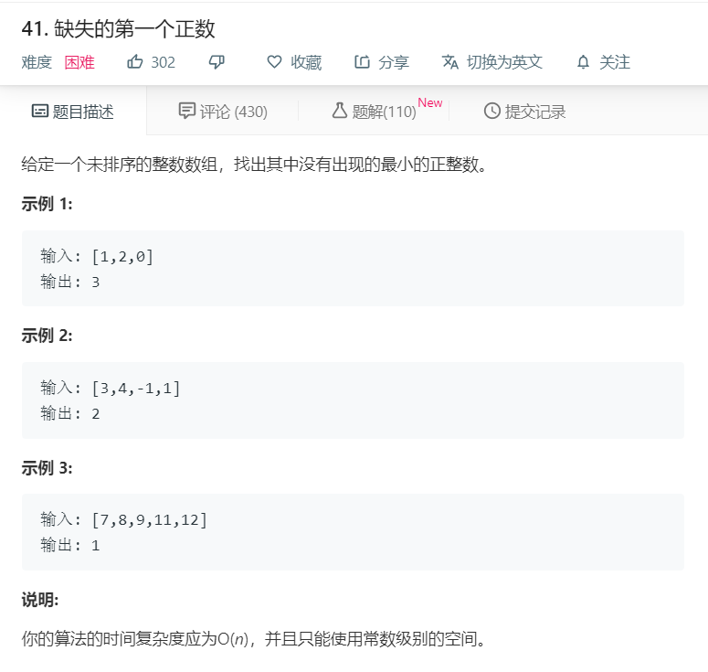

# 41缺失的第一个正数
  

## 自己的答案
```
/**
 * @param {number[]} nums
 * @return {number}
 */
var firstMissingPositive = function(nums) {
	nums.sort((a,b)=>a-b);
	let numleng = Array.from(new Set(nums.slice(0)));
	let mins = Math.min(...numleng);
	let maxnum = Math.max(...numleng);
	if(maxnum<=0){
		return 1;
	}

	if(mins<0 && maxnum>0){
		for(let i=1;i<maxnum;i++){
			if(numleng.indexOf(i)<0){
				return i;
			}
		}
		return maxnum + 1;
	}

	if(mins>=0){
		if(mins>1){
			return 1;
		}
		for(let i=1;i<nums.length;i++){
			if(nums[i]-nums[i-1] > 1){
				return nums[i-1] + 1;
			}
		}
		return maxnum + 1;
	}
	
};
```
