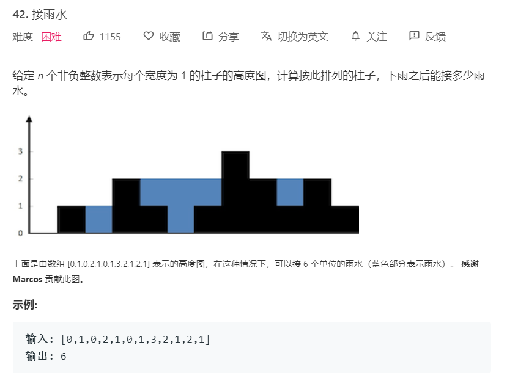

# 42.接雨水
  

```
/**
 * @param {number[]} height
 * @return {number}
 */
var trap = function(height) {
    let count = 0,length = height.length;

    let max = Math.max(...height),who = height.indexOf(max);

    let temp = height[0];
    for(let i=1;i<who;i++){
        if(height[i] < temp){
            count += (temp - height[i])
        }else{
            temp = height[i];
        }
    }

    temp = height[length - 1];
    for(let i=length-2;i > who;i--){
        if(height[i] < temp){
            count += (temp - height[i])
        }else{
            temp = height[i];
        }
    }

    return count;
};
```